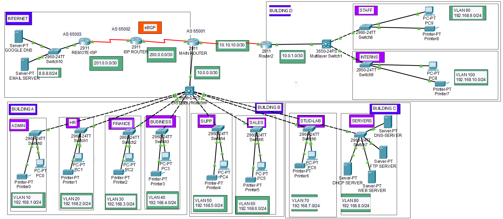

# Enterprise-Campus-Network-Design
Network Design of a Campus Area Network made in Packet Tracer.

##  O projekcie
Kompleksowa symulacja sieci korporacyjnej (Enterprise Network) zbudowana w programie Cisco Packet Tracer. Projekt prezentuje zaawansowane techniki trasowania (Routing), przełączania (Switching) oraz usług sieciowych, symulując rzeczywiste środowisko dużej firmy z wieloma budynkami, oddziałem zdalnym oraz połączeniem z globalnym Internetem za pomocą protokołu BGP.

##  Zastosowane technologie i protokoły
* **Routing Zewnętrzny (WAN/Edge):** eBGP (Border Gateway Protocol) z symulacją 3 systemów autonomicznych (AS 65001, AS 65002, AS 65003).
* **Routing Wewnętrzny (IGP):** Wdrożono redundancję warstwy 3. 
  * **OSPF (Area 0):** Ustawiony jako protokół główny (zmieniony Administrative Distance na 80).
  * **EIGRP (AS 100):** Ustawiony jako protokół zapasowy (AD 90).
* **Przełączanie i L2/L3:** VLAN, 802.1Q Trunking, Inter-VLAN Routing z użyciem przełączników wielowarstwowych (SVI na Cisco 3650).
* **Adresacja i Usługi:** Scentralizowany serwer DHCP z konfiguracją `ip helper-address` (DHCP Relay) dla 10 różnych podsieci, DNS, HTTP, FTP.
* **Bezpieczeństwo i Brzeg Sieci:** NAT (PAT / NAT Overload) dla całej sieci LAN wychodzącej do Internetu.
* **Aplikacje (L7):** Symulacja działającego serwera E-mail (SMTP/POP3) w zewnętrznym Data Center operatora.

1. **Zewnętrzna (INTERNET):** Łańcuch dostawców ISP połączonych przez eBGP, hostujący publiczny serwer DNS (8.8.8.8) oraz serwer pocztowy firmy.
2. **Główny Kampus (Budynki A, B, C):** Rdzeń sieci oparty o `DISTRIBUTION SW` (Multilayer Switch) zarządzający ruchem między zróżnicowanymi VLAN-ami. W Budynku C znajduje się centralna **Farma Serwerów**, w której hostowane są kluczowe usługi dla całej firmy:
   * **Centralny Serwer DHCP:** Rozdający adresację IP dla 10 różnych VLAN-ów we wszystkich budynkach (wykorzystanie `ip helper-address`).
   * **Wewnętrzny Serwer DNS:** Odpowiadający za rozwiązywanie nazw lokalnych (np. intranetowych stron i serwerów plików).
   * **Serwer WEB & FTP:** Udostępniający wewnętrzną stronę firmową oraz centralny dysk sieciowy dla pracowników.
3. **Zdalny Oddział (Budynek D):** Połączony przez łącze routowane P2P z główną siecią, posiadający własny switch wielowarstwowy dystrybuujący ruch dla lokalnych VLAN-ów.

##  Jak testować tę sieć? (Weryfikacja konfiguracji)
Jeśli pobrałeś plik `.pkt`, możesz samodzielnie przetestować zaimplementowane rozwiązania:

1. **Test DHCP Relay (ip helper-address):**
   * Wejdź na dowolny PC (np. w dziale HR lub w zdalnym Budynku D).
   * W zakładce *IP Configuration* przełącz z trybu Static na DHCP. Komputer bezbłędnie pobierze adres IP z centralnego serwera w Budynku C, pokonując routery i przełączniki L3.
2. **Test Usług Wewnętrznych (DNS, WEB, FTP):**
   * Otwórz *Web Browser* na PC pracownika i wpisz nazwę domenową (np. odpowiadającą serwerowi WEB). Wewnętrzny serwer DNS rozwiąże nazwę na IP, a serwer WEB wyświetli stronę firmową.
   * Otwórz *Command Prompt* na PC i wpisz polecenie `ftp [adres-serwera-ftp]`. Zaloguj się odpowiednimi poświadczeniami i użyj polecenia `dir`, aby wylistować pliki – udowadniając działanie protokołu FTP między VLAN-ami.
3. **Test dostępu do Internetu (NAT & BGP):** * W *Command Prompt* na dowolnym PC wewnątrz sieci LAN wpisz polecenie `ping 8.8.8.8` (Google DNS w chmurze).
   * Pakiety są maskowane przez NAT na głównym routerze, przechodzą przez systemy operatorów i wracają. Na `MAIN ROUTER` można to zweryfikować poleceniem `show ip nat translations`.
4. **Test Usług Zewnętrznych (Email SMTP/POP3):**
   * Użyj wbudowanego klienta *Email* na dwóch różnych komputerach, aby wysłać i odebrać wiadomość. Wiadomość zostanie zroutowana przez BGP do zewnętrznego Data Center (`EMAIL SERVER`) i z powrotem.
5. **Test Redundancji Routingu:**
   * Na `MAIN ROUTER` sprawdź tabelę routingu: `show ip route`.
   * Głównymi trasami wewnątrz firmy zarządza OSPF (Dystans Administracyjny zmieniony na 80). EIGRP (AD 90) pozostaje w gotowości jako protokół zapasowy.
