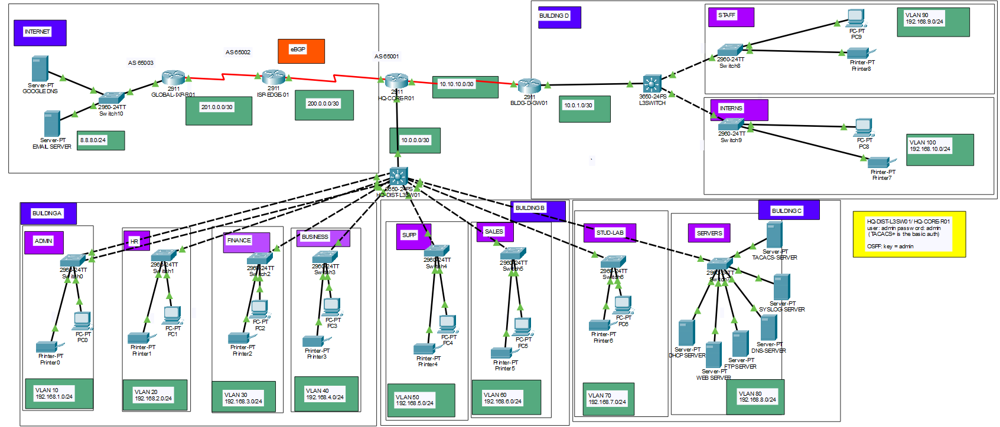

# Advanced Secure Enterprise Network Infrastructure

## Project Overview
This project features a comprehensive multi-site enterprise network architecture designed using Cisco Packet Tracer. It simulates a realistic corporate infrastructure with a focus on high availability, scalable routing protocols, and a multi-layered security approach (Defense in Depth). The topology includes several departmental buildings (including a dedicated Building D for Staff and Interns), a centralized server farm, and a secure edge connection to a simulated ISP.

## Network Topology

## Technical Architecture

### Layer 3 Routing & Connectivity
* **Edge Connectivity (BGP):** Implemented **eBGP (AS 65001)** on the `HQ-CORE-R01` router for external peering with the ISP.
* **Internal Routing (IGP):**
    * **OSPF:** Configured as the primary IGP with **MD5 Cryptographic Authentication** for route integrity across the core and distribution layers.
    * **EIGRP (AS 100):** Utilized for internal backbone routing between core segments and remote sites.
* **Inter-VLAN Routing:** Performed by the Layer 3 Distribution Switch (`HQ-DIST-L3SW01`) via SVIs, ensuring high-speed internal communication.
* **NAT/PAT:** Network Address Translation with Overload (PAT) is configured on the edge router to provide internet access for all internal private subnets.

### Switching & Redundancy
* **EtherChannel (LACP):** Link aggregation is deployed between the Distribution and Access layers to ensure 2Gbps logical bandwidth and hardware redundancy.
* **Spanning Tree Protocol (PVST+):** `HQ-DIST-L3SW01` is manually assigned as the **Root Bridge** for all active VLANs to ensure a deterministic, loop-free topology.
* **Network Segmentation:** **10 distinct VLANs** are implemented to isolate departmental traffic, reduce broadcast domains, and improve overall security:
    * **Building A/B:** Admin, HR, Finance, Business, Sales, Support.
    * **Building C:** Stud-Lab, Servers.
    * **Building D:** Staff, Interns.

## Security Implementation

### Layer 2 Security (Access Layer)
| Feature | Implementation Detail |
| :--- | :--- |
| **Port Security** | Hardened access ports with **Sticky MAC addresses** and strict violation restrictions (Restrict/Shutdown). |
| **DHCP Snooping** | Prevents Rogue DHCP server attacks by validating traffic on untrusted ports across the access layer. |
| **Dynamic ARP Inspection** | Mitigates Man-in-the-Middle (ARP Spoofing) by verifying ARP packets against the DHCP snooping database. |
| **STP Security** | **BPDU Guard** and **PortFast** enabled on edge ports to protect the STP topology from unauthorized switches. |

### Management & Control Plane Hardening
* **Centralized AAA (TACACS+):** Administrator authentication is offloaded to a dedicated TACACS+ server (`192.168.8.60`) for centralized identity and access management.
* **Secure Management:** Telnet is disabled globally. Remote management is restricted to **SSH** only.
* **Management ACLs:** Infrastructure access (VTY lines) is restricted via Access Control Lists, permitting only the Administrative subnet (`192.168.1.0/24`) to connect.
* **Routing Security:** MD5 authentication is enforced on all OSPF adjacencies to prevent unauthorized route injection or tampering.

## Infrastructure Services
* **DHCP Services:** Centralized IP address allocation via **IP-Helper (Relay Agent)** pointing to the server farm.
* **NTP (Network Time Protocol):** `HQ-CORE-R01` acts as the NTP Master, providing synchronized timestamps for consistent logging and security auditing.
* **Remote Logging (Syslog):** Critical events are forwarded to a central Syslog server (`192.168.8.50`) for infrastructure monitoring.
* **Server Farm:** Deployment of internal DNS, Web (HTTP), FTP, and Email services within VLAN 80.

## Access Credentials
* **Administrative User:** `admin` / `SuperAdmin`
* **TACACS+ / OSPF Key:** `admin`

---

### How to Run
1. Open the `.pkt` file using **Cisco Packet Tracer 8.x** or higher.
2. Allow a few moments for STP and OSPF/BGP convergence.
3. Test connectivity by pinging the external DNS server (`8.8.8.8`) from any internal PC.
4. Verify management security by attempting an SSH session from a non-admin VLAN (access should be blocked by ACL 10).
